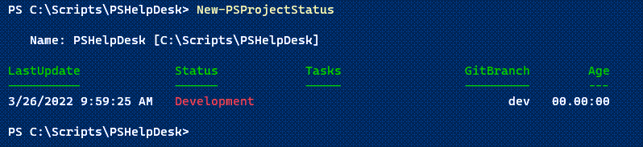
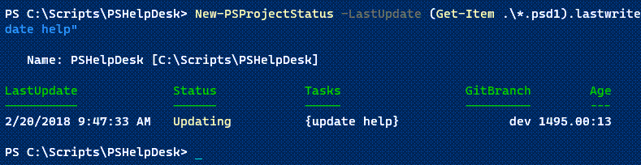
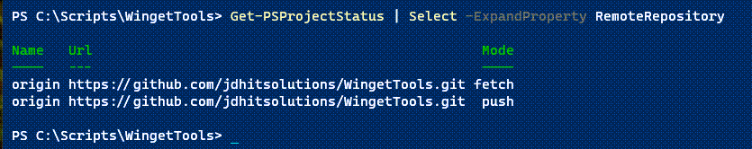
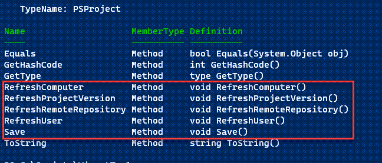
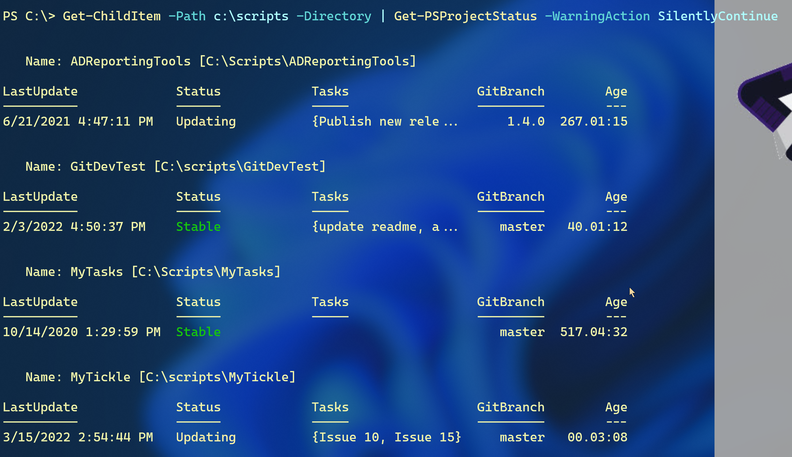
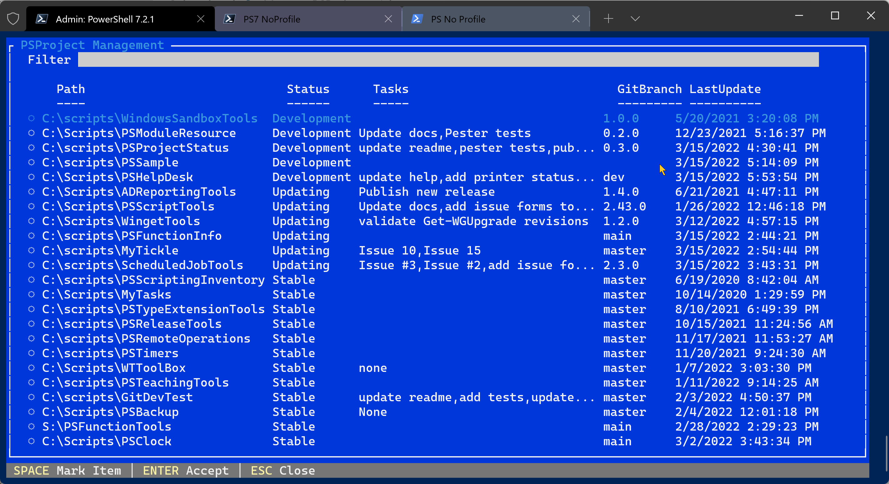
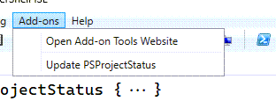
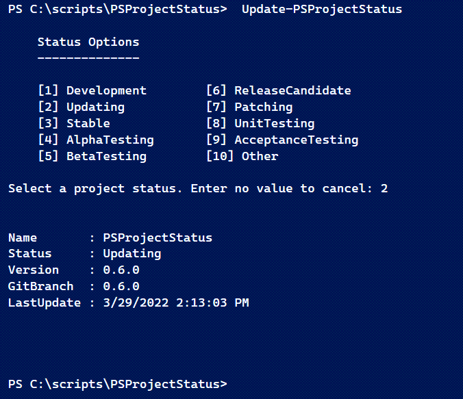
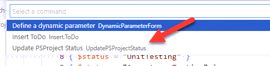
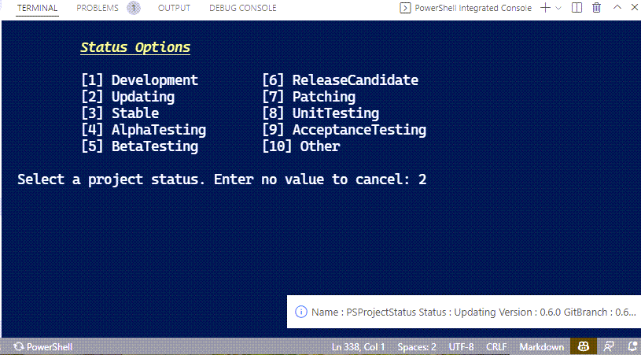

# PSProjectStatus

[](https://www.powershellgallery.com/packages/PSProjectStatus/) [](https://www.powershellgallery.com/packages/PSProjectStatus/)

This PowerShell module is designed to make it easier to manage your projects and modules. It provides a snapshot overview of the project's status. You can use this to quickly determine when you last worked on a module and what high-level tasks remain. Status information is stored in a JSON file that resides in the module's root directory. If you have initialized *git* for the module, the status will include the current branch.

## Installation

Install this module from the PowerShell Gallery.

```powershell
Install-Module PSProjectStatus
```

This module should work in Windows PowerShell and PowerShell 7.

## Class-Based

The status is based on a private class-based definition. The classes are used to construct the JSON file which in turn is used to create a `PSProject` object and update its properties.

```powershell
Class PSProjectRemote {
    [string]$Name
    [string]$Url
    [gitMode]$Mode

    PSProjectRemote ($Name, $url, $mode) {
        $this.Name = $Name
        $this.url = $url
        $this.mode = $mode
    }
   #allow an empty remote setting
    PSProjectRemote() {
        $this.Name = ''
        $this.url = ''
    }
}

Class PSProject {
    [string]$Name = (Split-Path (Get-Location).path -Leaf)
    [string]$Path = (Convert-Path (Get-Location).path)
    [DateTime]$LastUpdate = (Get-Date)
    [string[]]$Tasks = @()
    [PSProjectStatus]$Status = 'Development'
    [Version]$ProjectVersion = (Test-ModuleManifest ".\$(Split-Path $pwd -Leaf).psd1" -ErrorAction SilentlyContinue).version
    [string]$GitBranch = ''
    #using .NET classes to ensure compatibility with non-Windows platforms
    [string]$UpdateUser = "$([system.environment]::UserDomainName)\$([System.Environment]::Username)"
    [string]$Computername = [System.Environment]::MachineName
    [PSProjectRemote[]]$RemoteRepository = @()
    [string]$Comment = 'none'

    [void]Save() {
        $json = Join-Path -Path $this.path -ChildPath psproject.json
        #convert the ProjectVersion to a string in the JSON file
        #convert the LastUpdate to a formatted date string
        $this | Select-Object @{Name = '$schema'; Expression = { 'https://raw.githubusercontent.com/jdhitsolutions/PSProjectStatus/main/psproject.schema.json' } },
        Name, Path,
        @{Name = 'LastUpdate'; Expression = { '{0:o}' -f $_.LastUpdate } },
        @{Name = 'Status'; Expression = { $_.status.toString() } },
        @{Name = 'ProjectVersion'; Expression = { $_.ProjectVersion.toString() } },
        UpdateUser, Computername, RemoteRepository, Tasks, GitBranch, Comment |
        ConvertTo-Json | Out-File -FilePath $json -Encoding utf8
    }
    [void]RefreshProjectVersion() {
        $this.ProjectVersion = (Test-ModuleManifest ".\$(Split-Path $pwd -Leaf).psd1" -ErrorAction SilentlyContinue).version
    }
    [void]RefreshUser() {
        $this.UpdateUser = "$([system.environment]::UserDomainName)\$([System.Environment]::Username)"
    }
    [void]RefreshComputer() {
        $this.Computername = [System.Environment]::MachineName
    }
    [void]RefreshRemoteRepository() {
        if (Test-Path .git) {
            $remotes = git remote -v
            if ($remotes) {
                $repos = @()
                foreach ($remote in $remotes) {
                    $split = $remote.split()
                    $RemoteName = $split[0]
                    $Url = $split[1]
                    $Mode = $split[2].replace('(', '').Replace(')', '')
                    $repos += [PSProjectRemote]::new($remotename, $url, $mode)
                } #foreach
                $this.RemoteRepository = $repos
            } #if remotes found
        }
    }

    [void]RefreshAll() {
        $this.RefreshProjectVersion()
        $this.RefreshUser()
        $this.RefreshComputer()
        $this.RefreshRemoteRepository()
        $this.Save()
    }
}
```

The class includes a status enumeration.

```powershell
enum PSProjectStatus {
    Development
    Updating
    Stable
    AlphaTesting
    BetaTesting
    ReleaseCandidate
    Patching
    UnitTesting
    AcceptanceTesting
    Other
}
```

At this time it is not possible to include a user-defined status. It is hoped that you can find something appropriate from the current status list.

The `Age` ScriptProperty and `VersionInfo` property set are added to the object as type extensions.

```xml
<?xml version="1.0" encoding="utf-8"?>
<Types>
  <Type>
    <Name>PSProject</Name>
    <Members>
      <PropertySet>
        <Name>versionInfo</Name>
        <ReferencedProperties>
          <Name>Name</Name>
          <Name>Status</Name>
          <Name>Version</Name>
          <Name>GitBranch</Name>
          <Name>LastUpdate</Name>
        </ReferencedProperties>
      </PropertySet>
      <AliasProperty>
        <Name>Version</Name>
        <ReferencedMemberName>ProjectVersion</ReferencedMemberName>
      </AliasProperty>
      <AliasProperty>
        <Name>Username</Name>
        <ReferencedMemberName>UpdateUser</ReferencedMemberName>
      </AliasProperty>
      <ScriptProperty>
        <Name>Age</Name>
        <GetScriptBlock> (Get-Date) - $this.lastUpdate </GetScriptBlock>
      </ScriptProperty>
    </Members>
  </Type>
</Types>
```

> Note that some screen shots may be incomplete as I am still adding properties to the PSProject class.

## Creating a Project Status

To create a project status file, navigate to the module root and run [New-PSProjectStatus](docs/New-PSProjectStatus.md). The default status is `Development`



You can update properties when you create the project status.

```powershell
New-PSProjectStatus -LastUpdate (Get-Item .\*.psd1).lastwritetime -Status Updating -tasks "update help"
```



The command will create `psproject.json` in the root folder.

```json
{
  "$schema": "https://raw.githubusercontent.com/jdhitsolutions/PSProjectStatus/main/psproject.schema.json",
  "Name": "PSHelpDesk",
  "Path": "C:\\Scripts\\PSHelpDesk",
  "LastUpdate": "2022-02-20T09:47:33-05:00",
  "Status": 1,
  "ProjectVersion": "0.1.0",
  "UpdateUser": "PROSPERO\\Jeff",
  "Computername": "PROSPERO",
  "RemoteRepository": null,
  "Tasks": [
    "update help"
  ],
  "GitBranch": "dev"
}
```

Note that the update time is formatted as a UTC string. The Project version will be pulled from the module manifest if found. You can set this to a different value manually in the JSON file or by running `Set-PSProjectStatus`.

> If you are using *git* with your module you may want to add `psproject.json` to your `.gitignore` file.

## Getting a Project Status

The easiest way to view a project status is by using [Get-PSProjectStatus](docs/New-PSProjectStatus.md).

```dos
PS C:\scripts\PSCalendar> Get-PSProjectStatus


   Name: PSCalendar [C:\Scripts\PSCalendar]

LastUpdate             Status            Tasks                 GitBranch        Age
----------             ------            -----                 ---------        ---
3/3/2022 10:24:49 AM   Patching          {Update help docu...      2.9.0   12.07:07
```

If the host supports ANSI, a status of `Stable` will be displayed in Green. `Development` will be shown in Red and `Updating` in Yellow.

The module has a default list view.

```dos
PS C:\scripts\PSCalendar> Get-PSProjectStatus | Format-List


   Project: PSCalendar [C:\Scripts\PSCalendar]

Version    : 2.9.0
Status     : Patching
Tasks      : {Update help documentation, Issue #31, Issue #34, Issue #33}
GitBranch  : 2.9.0
LastUpdate : 3/3/2022 10:24:49 AM
```

This makes it easier to view tasks.

## Updating a Project Status

To update the project status, you could always manually update the JSON file in your script editor. Use this code snippet to get the DateTime value in the proper format.

```powershell
Get-Date -format o | Set-Clipboard
```

Paste the value into the file.

The `Status` value is an integer indicating a private enumeration value.

```text
Development = 0
Updating = 1
Stable = 2
AlphaTesting = 3
BetaTesting = 4
ReleaseCandidate = 5
Patching = 6
UnitTesting = 7
AcceptanceTesting = 8
Other = 9
Archive = 10
```

Or use the [Set-PSProjectStatus](docs/Set-PSProjectStatus.md) function.

```dos
PS C:\scripts\PSHelpDesk> Set-PSProjectStatus -LastUpdate (Get-Date) -Status Development -Tasks "add printer status function","revise user password function" -Concatenate


   Name: PSHelpDesk [C:\Scripts\PSHelpDesk]

LastUpdate             Status            Tasks                 GitBranch        Age
----------             ------            -----                 ---------        ---
3/15/2022 5:53:54 PM   Development  {update help, add...             dev   00.00:00
```

When defining tasks, use `-Concatenate` to append the tasks. Otherwise, tasks will be overwritten with the new value.

## Source Control Status

The commands in this module assume you are most likely using `git` for source control. The status object will automatically detect the local git branch. It will also detect the primary remote repositories.



## Manually Updating with the Object

The PSProject class has been updated since the first version of this module was released. You can use the object's methods to refresh some properties. Here is an example of an incomplete status.

```dos
PS C:\Scripts\WingetTools> Get-PSProjectStatus | Select-Object *

Name             : WingetTools
Status           : Stable
Version          :
GitBranch        : main
LastUpdate       : 3/17/2022 9:46:35 AM
Age              : 9.00:22:39.3936893
Path             : C:\Scripts\WingetTools
ProjectVersion   :
UpdateUser       : THINKX1-JH\Jeff
Computername     :
RemoteRepository : {}
Tasks            : {}
Comment          :
```

To update, get a reference to the project status object.

```powershell
$p = Get-PSProjectStatus
```

`Get-Member` will show you the available methods.



Invoke the methods that apply to your project. You need to invoke the `Save()` method to commit the changes to the JSON file.

```powershell
$p.RefreshComputer()
$p.RefreshUser()
$p.RefreshProjectVersion()
$p.RefreshRemoteRepository()
$p.save()
```

![refresh a project status]As an alternative can use the `RefreshAll()` method which will invoke all the refresh methods __and__ save the file.

## Project Management

If you have many projects, you can use this module to manage all of them.

```powershell
Get-ChildItem -Path c:\scripts -Directory | Get-PSProjectStatus -WarningAction SilentlyContinue
```



You will want to suppress Warning messages. If you are running PowerShell 7 and have the ConsoleGuiTools module installed, you can run a script like this:

```powershell
#requires -version 7.2
#requires -module Microsoft.PowerShell.ConsoleGuiTools

#open a project using the PSProject status

Import-Module PSProjectStatus -Force

$all = Get-ChildItem -Path C:\scripts -Directory |
Get-PSProjectStatus -WarningAction SilentlyContinue
$all | Sort-Object Status, LastUpdate |
Select-Object Path, Status, @{Name = "Tasks"; Expression = { $_.Tasks -join ',' } },
GitBranch, LastUpdate |
Out-ConsoleGridView -Title "PSProject Management" -OutputMode Single |
ForEach-Object { code $_.path }
```

This will give you a list of projects.



You can select a single project, press Enter, and open the folder in VS Code. You could write a similar script for Windows PowerShell using `Out-GridView`.

### [Get-PSProjectReport](docs\Get-PSProjectReport.md)

Beginning with version '0.10.0` you can use `Get-PSProjectReport` to simplify project management.

You can get all projects.

```powershell
Get-PSProjectReport c:\scripts
```

You can filter by status.

```powershell
PS C:\> Get-PSProjectReport c:\scripts -Status Other

   Name: PSMessaging [C:\Scripts\PSMessaging]

LastUpdate             Status            Tasks         GitBranch        Age
----------             ------            -----         ---------        ---
7/20/2022 11:58:54 AM  Other             {}                master  192.02:11
```

And you can filter by age.

```powershell
PS C:\> Get-PSProjectReport c:\scripts -NewerThan 10 -Status Stable


   Name: PluralsightTools [C:\Scripts\PluralsightTools]

LastUpdate             Status            Tasks             GitBranch        Age
----------             ------            -----             ---------        ---
1/20/2023 2:20:39 PM   Stable            {convert modu...       main   07.23:51
```

## Removing Project Status

If no you longer want to track the project status for a given folder, all you have to do is delete the associated JSON file. As an alternative, you may want to set a status of `Archive`.

## Editor Integrations

If you import this module into your PowerShell editor, either Visual Studio Code or the PowerShell ISE, the module will add an update function called `Update-PSProjectStatus`. You can run the command from the integrated terminal or use the appropriate shortcut. The command will the status based on user input, update the `LastUpdate` time to the current date and time, update the project version from the module manifest (if found), and update the git branch if found.

You need to make sure your terminal or console window is set to your project's root directory.

### PowerShell ISE

If you import the module in the PowerShell ISE, it will add a menu shortcut under `Add-Ons`.



Click the shortcut and a status menu will be displayed in the console pane.



Select a status and press <kbd>Enter</kbd> The function will call `Set-PSProjectStatus` and display the updated `versioninfo` property.

### VS Code

Likewise, in VS Code open the command palette and go to `PowerShell: Show Additional commands from PowerShell modules`. You should see an option to update.



Select the menu choice and switch to the integrated terminal window.



The menu will loop and display until you enter a valid number or press Enter with no value. The summary will be displayed as a VSCode information message.

### JSON Schema

A public JSON [schema file](https://raw.githubusercontent.com/jdhitsolutions/PSProjectStatus/main/psproject.schema.json) was published with v0.8.0. If you edit the `psproject.json` file in VSCode, you should get tab completion for many of the settings. If you have a configuration file created with an earlier version of the module, run `Set-PSProjectStatus` with any parameter. This will insert the schema reference into the JSON file. Then you can edit the file in VSCode.

## Road Map

These are a few things I'm considering or have been suggested.

+ Additional properties
  + priority
  + project type
  + tags
+ Extend the module to integrate into a SQLite database file.
+ Editor integration to manage project tasks.
+ A WPF form to display the project status and make it easier to edit tasks.

If you have any suggestions on how to extend this module or tips to others on how you are using it, please feel free to use the [Discussions](https://github.com/jdhitsolutions/PSProjectStatus/discussions) section of this module's GitHub repository.
