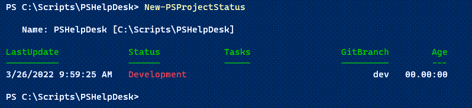
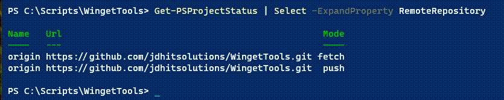
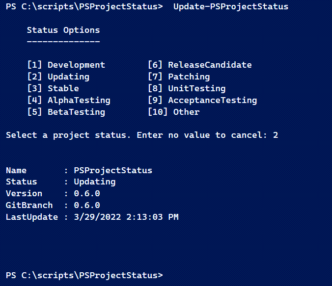
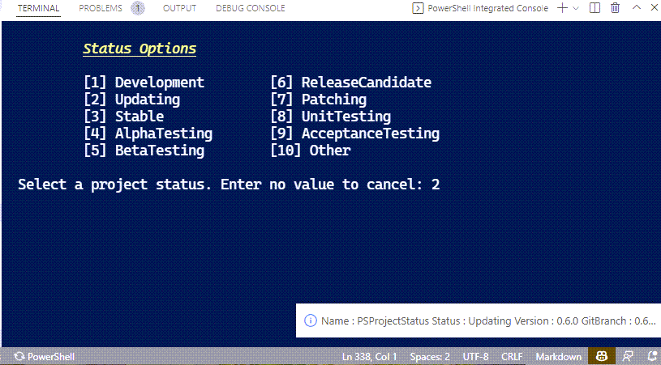

# PSProjectStatus

[](https://www.powershellgallery.com/packages/PSProjectStatus/) [](https://www.powershellgallery.com/packages/PSProjectStatus/)

Ce module PowerShell est conçu pour faciliter la gestion de vos projets et modules. Il fournit un aperçu de l'état du projet. Vous pouvez l'utiliser pour déterminer rapidement quand vous avez travaillé pour la dernière fois sur un module et quelles tâches de haut niveau restent à faire. Les informations d'état sont stockées dans un fichier JSON qui se trouve dans le répertoire racine du module. Si vous avez initialisé *git* pour le module, l'état du projet inclura la branche actuelle.

## Installation

Installez ce module depuis la [PowerShell Gallery](https://www.powershellgallery.com/packages/PSProjectStatus).

```powershell
Install-Module PSProjectStatus
```

Ou vous pouvez utiliser le module [`Microsoft.PowerShell.PSResourceGet`](https://github.com/PowerShell/PSResourceGet/).

```powershell
Install-PSResource PSProjectStatus -Scope AllUsers
```

Ce module est pris en charge dans Windows PowerShell 5.1 et PowerShell 7.

## Commandes du module

### Statut

- [New-PSProjectStatus](../docs-fr/New-PSProjectStatus.md)
- [Get-PSProjectStatus](../docs-fr/Get-PSProjectStatus.md)
- [Set-PSProjectStatus](../docs-fr/Set-PSProjectStatus.md)

### Tâches

- [New-PSProjectTask](../docs-fr/New-PSProjectTask.md)
- [Get-PSProjectTask](../docs-fr/Get-PSProjectTask.md)
- [Remove-PSProjectTask](../docs-fr/Remove-PSProjectTask.md)

### Autres

- [Get-PSProjectReport](../docs-fr/Get-PSProjectReport.md)
- [Get-PSProjectGitStatus](../docs-fr/Get-PSProjectGitStatus.md)
- [Open-PSProjectStatusHelp](../docs-fr/Open-PSProjectStatusHelp.md)

Après avoir importé le module, vous pouvez exécuter `Open-PSProjectStatusHelp` qui ouvrira une version PDF de ce document dans l'application par défaut associée aux fichiers PDF. Ou si vous utilisez PowerShell 7, vous pouvez utiliser le paramètre dynamique `-AsMarkdown` pour lire ce fichier en utilisant le formatage markdown. Toutes les fonctionnalités markdown peuvent ne pas s'afficher correctement dans la console.

## Basé sur des classes

L'état du projet est basé sur une définition privée basée sur des classes. Les classes PowerShell sont utilisées pour construire le fichier JSON qui à son tour est utilisé pour créer un objet `PSProject` et mettre à jour ses propriétés.

```powershell
Class PSProjectRemote {
  [string]$Name
  [string]$Url
  [gitMode]$Mode

  PSProjectRemote ($Name, $url, $mode) {
      $this.Name = $Name
      $this.url = $url
      $this.mode = $mode
  }
  #autoriser un paramètre distant vide
  PSProjectRemote() {
      $this.Name = ''
      $this.url = ''
  }
}

Class PSProjectTask {
  [string]$ProjectName
  [string]$Path
  [string]$TaskDescription
  [version]$ProjectVersion
  [int]$TaskID

  PSProjectTask ($TaskDescription,$Path,$ProjectName,$ProjectVersion) {
      $this.ProjectName = $ProjectName
      $this.Path = $Path
      $this.TaskDescription = $TaskDescription
      $this.ProjectVersion = $ProjectVersion
  }
}

#J'ai formaté les lignes plus longues avec des sauts de ligne artificiels
#pour tenir sur une page imprimée.
Class PSProject {
  [string]$Name = (Split-Path (Get-Location).path -Leaf)
  [string]$Path = (Convert-Path (Get-Location).path)
  [DateTime]$LastUpdate = (Get-Date)
  [string[]]$Tasks = @()
  [PSProjectStatus]$Status = 'Development'
  [Version]$ProjectVersion = (Test-ModuleManifest ".\$(Split-Path $pwd `
  -Leaf).psd1" -ErrorAction SilentlyContinue).version
  [string]$GitBranch = ''
  #utilisation des classes .NET pour assurer la compatibilité avec les
  #plateformes non-Windows
  [string]$UpdateUser = "$([System.Environment]::UserDomainName)\`
  $([System.Environment]::Username)"
  [string]$Computername = [System.Environment]::MachineName
  [PSProjectRemote[]]$RemoteRepository = @()
  [string]$Comment = ''

  [void]Save() {
      $json = Join-Path -Path $this.path -ChildPath psproject.json
      #convertir la ProjectVersion en chaîne dans le fichier JSON
      #convertir la LastUpdate en chaîne de date formatée
      $this | Select-Object @{Name = '$schema'; Expression = {
      'https://raw.githubusercontent.com/jdhitsolutions/PSProjectStatus/
      main/psproject.schema.json' } },
      Name, Path,
      @{Name = 'LastUpdate'; Expression = { '{0:o}' -f $_.LastUpdate }},
      @{Name = 'Status'; Expression = { $_.status.toString() } },
      @{Name = 'ProjectVersion'; Expression = {
        $_.ProjectVersion.toString()}},UpdateUser, Computername,
        RemoteRepository, Tasks, GitBranch, Comment |
      ConvertTo-Json | Out-File -FilePath $json -Encoding utf8
  }
  [void]RefreshProjectVersion() {
      $this.ProjectVersion = (Test-ModuleManifest ".\$(Split-Path $pwd `
      -Leaf).psd1" -ErrorAction SilentlyContinue).version
  }
  [void]RefreshUser() {
      $this.UpdateUser = "$([System.Environment]::UserDomainName)\`
      $([System.Environment]::Username)"
  }
  [void]RefreshComputer() {
      $this.Computername = [System.Environment]::MachineName
  }
  [void]RefreshRemoteRepository() {
      if (Test-Path .git) {
          $remotes = git remote -v
          if ($remotes) {
              $repos = @()
              foreach ($remote in $remotes) {
                  $split = $remote.split()
                  $RemoteName = $split[0]
                  $Url = $split[1]
                  $Mode = $split[2].replace('(', '').Replace(')', '')
                  $repos += [PSProjectRemote]::new($RemoteName, $url,
                  $mode)
              } #foreach
              $this.RemoteRepository = $repos
          } #si des remotes sont trouvés
      }
  }

  [void]RefreshAll() {
      $this.RefreshProjectVersion()
      $this.RefreshUser()
      $this.RefreshComputer()
      $this.RefreshRemoteRepository()
      $this.Save()
  }
}
```

La classe inclut une énumération de statut.

```powershell
enum PSProjectStatus {
    Development
    Updating
    Stable
    AlphaTesting
    BetaTesting
    ReleaseCandidate
    Patching
    UnitTesting
    AcceptanceTesting
    Other
}
```

Pour le moment, il n'est pas possible d'inclure un statut de projet défini par l'utilisateur. On espère que vous pourrez trouver quelque chose d'approprié dans la liste des statut actuels.

La propriété ScriptProperty `Age` et les ensembles de propriétés `VersionInfo` sont ajoutés à l'objet en tant qu'extensions de type.

```xml
<?xml version="1.0" encoding="utf-8"?>
<Types>
  <Type>
    <Name>PSProject</Name>
    <Members>
      <PropertySet>
        <Name>versionInfo</Name>
        <ReferencedProperties>
          <Name>Name</Name>
          <Name>Status</Name>
          <Name>Version</Name>
          <Name>GitBranch</Name>
          <Name>LastUpdate</Name>
        </ReferencedProperties>
      </PropertySet>
      <AliasProperty>
        <Name>Version</Name>
        <ReferencedMemberName>ProjectVersion</ReferencedMemberName>
      </AliasProperty>
      <AliasProperty>
        <Name>Username</Name>
        <ReferencedMemberName>UpdateUser</ReferencedMemberName>
      </AliasProperty>
      <ScriptProperty>
        <Name>Age</Name>
        <GetScriptBlock> (Get-Date) - $this.lastUpdate </GetScriptBlock>
      </ScriptProperty>
    </Members>
  </Type>
</Types>
```

> Notez que certaines captures d'écran peuvent être incomplètes car j'ajoute encore des propriétés à la classe PSProject.

## Création d'un statut de projet

Pour créer un fichier de statut de projet, naviguez jusqu'à la racine du module et exécutez [New-PSProjectStatus](../docs-fr/New-PSProjectStatus.md). Le statut par défaut est `Development`.



Vous pouvez mettre à jour les propriétés lors de la création du statut du projet.

```powershell
New-PSProjectStatus -LastUpdate (Get-Item .\*.psd1).LastWriteTime -Status `
Updating -tasks "update help"
```


La commande créera `psproject.json` dans le dossier racine.

```json
{
  "$schema": "https://raw.githubusercontent.com/jdhitsolutions/
  PSProjectStatus/main/psproject.schema.json",
  "Name": "PSHelpDesk",
  "Path": "C:\\Scripts\\PSHelpDesk",
  "LastUpdate": "2024-02-20T09:47:33-05:00",
  "Status": "Updating",
  "ProjectVersion": "0.1.0",
  "UpdateUser": "PROSPERO\\Jeff",
  "Computername": "PROSPERO",
  "RemoteRepository": [],
  "Tasks": [
    "update help"
  ],
  "GitBranch": "dev",
  "Tags : [],
  "Comment": ""
}
```

Notez que l'heure de mise à jour est formatée en tant que chaîne UTC. La version du projet sera extraite du manifeste du module si trouvé. Vous pouvez définir cette valeur manuellement dans le fichier JSON ou en exécutant `Set-PSProjectStatus`.

> :octocat: Si vous utilisez *git* avec votre module, vous pouvez ajouter `psproject.json` à votre fichier `.gitignore`.

## Obtention d'un statut de projet

La façon la plus simple de visualiser un statut de projet est d'utiliser [Get-PSProjectStatus](../docs-fr/Get-PSProjectStatus.md).

```powershell
PS C:\scripts\PSCalendar> Get-PSProjectStatus

   Name: PSCalendar [C:\Scripts\PSCalendar]

LastUpdate             Status         Tasks                 GitBranch        Age
----------             ------         -----                 ---------        ---
3/3/2024 10:24:49 AM   Patching       {Update help docu...      2.9.0   12.07:07
```

Si l'hôte PowerShell prend en charge l'ANSI, un statut de `Stable` sera affiché en vert. `Development` sera affiché en rouge et `Updating` en jaune.

Le module a une vue de liste par défaut.

```powershell
PS C:\scripts\PSCalendar> Get-PSProjectStatus | Format-List

   Project: PSCalendar [C:\Scripts\PSCalendar]

Version    : 2.9.0
Status     : Patching
Tasks      : {Update help documentation, Issue #31,Issue #34,Issue #33}
GitBranch  : 2.9.0
LastUpdate : 3/3/2024 10:24:49 AM
```

Cela facilite la visualisation des tâches.

## Mise à jour d'un statut de projet

Pour mettre à jour le statut du projet, vous pouvez toujours mettre à jour manuellement le fichier JSON dans votre éditeur de script. Utilisez cet extrait de code pour obtenir la valeur DateTime au format approprié.

```powershell
Get-Date -format o | Set-Clipboard
```

Collez la valeur dans le fichier.

La valeur `Statut` est un entier indiquant une valeur d'énumération privée.

```text
Development = 0
Updating = 1
Stable = 2
AlphaTesting = 3
BetaTesting = 4
ReleaseCandidate = 5
Patching = 6
UnitTesting = 7
AcceptanceTesting = 8
Other = 9
Archive = 10
```

Ou utilisez la fonction [Set-PSProjectStatus](../docs-fr/Set-PSProjectStatus.md).

```powershell
PS C:\scripts\PSHelpDesk\> $tasks = "add printer status function",
"revise user password function"
PS C:\scripts\PSHelpDesk> Set-PSProjectStatus -LastUpdate (Get-Date) `
-Status Development -Tasks $tasks -Concatenate


   Name: PSHelpDesk [C:\Scripts\PSHelpDesk]

LastUpdate             Status        Tasks                  GitBranch        Age
----------             ------        -----                  ---------        ---
3/15/2024 5:53:54 PM   Development   {update help, add...         dev   00.00:00
```

Lors de la définition des tâches, utilisez `-Concatenate` pour ajouter les tâches. Sinon, les tâches seront écrasées par la nouvelle valeur.

## Status du contrôle de source

Les commandes de ce module supposent que vous utilisez probablement `git` pour le contrôle de source. L'objet de statut détectera automatiquement la branche git locale. Il détectera également les principaux dépôts distants.



## Mise à jour manuelle avec l'objet

La classe PSProject a été mise à jour depuis la première version de ce module. Vous pouvez utiliser les méthodes de l'objet pour actualiser certaines propriétés. Voici un exemple de statut incomplet.

```powershell
PS C:\Scripts\WingetTools> Get-PSProjectStatus | Select-Object *

Name             : WingetTools
Status           : Stable
Version          :
GitBranch        : main
LastUpdate       : 3/17/2024 9:46:35 AM
Age              : 9.00:22:39.3936893
Path             : C:\Scripts\WingetTools
ProjectVersion   :
UpdateUser       : THINKX1-JH\Jeff
Computername     :
RemoteRepository : {}
Tasks            : {}
Comment          :
Tags             : {}
```

Pour mettre à jour, obtenez une référence à l'objet de statut du projet.

```powershell
$p = Get-PSProjectStatus
```

`Get-Member` vous montrera les méthodes disponibles.


Invoquez les méthodes qui s'appliquent à votre projet. Vous devez invoquer la méthode `Save()` pour valider les modifications dans le fichier JSON.

```powershell
$p.RefreshComputer()
$p.RefreshUser()
$p.RefreshProjectVersion()
$p.RefreshRemoteRepository()
$p.save()
```

En alternative, vous pouvez utiliser la méthode `RefreshAll()` qui invoquera toutes les méthodes de rafraîchissement __et__ enregistrera le fichier.

## Tâches de projet

Ce module est destiné à être un outil de gestion de projet _simple_. Vous pouvez l'utiliser pour suivre les tâches ou les éléments à faire. Ceux-ci sont ajoutés à la propriété `Tâches` en tant que tableau de chaînes. Vous pouvez les ajouter manuellement au fichier JSON ou utiliser la fonction `Set-PSProjectStatus`.

```powershell
C:\Scripts\PSProjectStatus> $params = @{
 Tasks="Update missing online help links"
 Concatenate=$true
 }

C:\Scripts\PSProjectStatus> Set-PSProjectStatus @params

   Name: PSProjectStatus [C:\Scripts\PSProjectStatus]

LastUpdate             Status         Tasks                 GitBranch        Age
----------             ------         -----                 ---------        ---
12/22/2024 9:08:30 AM  Updating       {Consider a schema …     0.11.0   00.00:00
```

Ou vous pouvez utiliser les commandes liées aux tâches.


Si l'hôte PowerShell le prend en charge, vous devriez obtenir un formatage ANSI. L'ID de la tâche est généré automatiquement pour chaque élément et affiché entre crochets.

Vous pouvez également ajouter une tâche.


Vous pouvez supprimer manuellement des éléments du fichier JSON ou utiliser la fonction `Remove-PSProjectTask`. Vous devrez connaître l'ID de la tâche.

```powershell
Remove-PSProjectTask -TaskID 4
```

Note : *L'objet `PSProjectTask` est défini dans une classe PowerShell. La classe est définie en tenant compte des améliorations futures. Toutes les propriétés définies ne sont pas utilisées pour le moment.*

## Gestion de projet

Si vous avez de nombreux projets, vous pouvez utiliser ce module pour les gérer tous.

```powershell
Get-ChildItem -Path c:\scripts -Directory |
Get-PSProjectStatus -WarningAction SilentlyContinue
```


Vous voudrez supprimer les messages d'avertissement. Si vous utilisez PowerShell 7 et que vous avez installé le module `Microsoft.PowerShell.ConsoleGuiTools`, vous pouvez exécuter un script comme celui-ci :

```powershell
#requires -version 7.2
#requires -module Microsoft.PowerShell.ConsoleGuiTools

#ouvrir un projet en utilisant le Status PSProject

Import-Module PSProjectStatus -Force

#Énumérer tous les répertoires et obtenir le statut du projet pour chacun
$all = Get-ChildItem -Path C:\scripts -Directory |
Get-PSProjectStatus -WarningAction SilentlyContinue

#Envoyer la sortie du répertoire à Out-ConsoleGridView
#et ouvrir le projet sélectionné dans VS Code
$all | Sort-Object Status, LastUpdate |
Select-Object Path, Status,
@{Name = "Tasks"; Expression = { $_.Tasks -join ',' } },
GitBranch, LastUpdate |
Out-ConsoleGridView -Title "PSProject Management" -OutputMode Single |
ForEach-Object { code $_.path }
```

Cela vous donnera une liste de projets.


Vous pouvez sélectionner un seul projet, appuyer sur Entrée et ouvrir le dossier dans VS Code. Vous pouvez écrire un script similaire pour Windows PowerShell en utilisant `Out-GridView`.

### [Get-PSProjectReport](../docs-fr/Get-PSProjectReport.md)

À partir de la version `0.10.0`, vous pouvez utiliser `Get-PSProjectReport` pour simplifier la gestion de projet.

Vous pouvez obtenir tous vos projets.

```powershell
Get-PSProjectReport c:\scripts
```

Vous pouvez filtrer par statut.

```powershell
PS C:\> Get-PSProjectReport c:\scripts -Status Other

   Name: PSMessaging [C:\Scripts\PSMessaging]

LastUpdate            Status     Tasks      GitBranch           Age
-----------------     ------     -----      --------            ---
20/07/2022 11:58:54   Other      {}               master  192.02:11
```

Et vous pouvez filtrer par Age.

```powershell
PS C:\> Get-PSProjectReport c:\scripts -NewerThan 10 -Status Stable

   Name: PluralsightTools [C:\Scripts\PluralsightTools]

LastUpdate            Status     Tasks             GitBranch        Age
-----------------     ------     -----             ---------        ---
20/01/2023 14:20:39   Stable     {convert modu...       main   07.23:51
```

## Tags de Projet

Le support des Tags a été ajouté dans la version 0.12.0. Vous pouvez définir des Tags lors de la création du fichier de statut du projet.

```powershell
New-PSProjectStatus -Tasks "prototype" -Tags tui - -version 0.2.0
```

Ou vous pouvez les ajouter plus tard.

```powershell
Set-PSProjectStatus -Tags "beta","tui"
```

Lorsque vous utilisez cette commande, vous devez redéfinir les Tags existantes. Ou ajoutez les Tags manuellement au fichier JSON.

Vous pouvez afficher les Tags avec une vue formatée en liste.

```powershell
PS C:\work\terminalgui> Get-PSProjectStatus | Format-List

   Project: terminalgui [C:\work\terminalgui]

Version    : 0.2.0
Status     : Développement
Tasks      : {prototype}
Tags       : {beta, tui}
GitBranch  :
LastUpdate : 27/12/2024 17:11:30
Age        : 00:02:48.0251636
```

Vous êtes le plus susceptible d'utiliser des Tags lors de la gestion de plusieurs projets. `Get-PSProjectReport` inclut un paramètre `-Tag` pour que vous puissiez filtrer depuis votre dossier parent.

```powershell
PS C:\> Get-PSProjectReport -path c:\scripts -Tag json

   Name: PSProjectStatus [C:\Scripts\PSProjectStatus]

LastUpdate            Status       Tasks                 GitBranch        Age
-----------------     ------       -----                 ---------        ---
27/12/2024 17:16:52   Updating     {Create TUI-based m…     0.12.0   00.00:00
```

Si vous souhaitez supprimer des Tags, modifiez manuellement le fichier JSON ou utilisez `Set-PSProjectStatus` et définissez un tableau vide.

```powershell
Set-PSProjectStatus -Tags @()
```

## Suppression du Status du Projet

Si vous ne souhaitez plus suivre le statut du projet pour un dossier donné, supprimez simplement le fichier JSON associé. En alternative, vous pouvez définir le statut sur `Archive`.

## Extensions du Module

### Extensions de Type

Les commandes de ce module ont défini des extensions de type. Des alias et des propriétés de script ont été définis.

```powershell
PS C:\Scripts\PSProjectStatus> Get-PSProjectstatus |
Get-Member -MemberType Properties,PropertySet

   TypeName: PSProject

Name             MemberType     Definition
----             ----------     ----------
Username         AliasProperty  Username = UpdateUser
Version          AliasProperty  Version = ProjectVersion
Comment          Property       string Comment {get;set;}
Computername     Property       string Computername {get;set;}
GitBranch        Property       string GitBranch {get;set;}
LastUpdate       Property       datetime LastUpdate {get;set;}
Name             Property       string Name {get;set;}
Path             Property       string Path {get;set;}
ProjectVersion   Property       version ProjectVersion {get;set;}
RemoteRepository Property       PSProjectRemote[] RemoteRepository  ...
Status           Property       PSProjectStatus Status {get;set;}
Tags             Property       string[] Tags {get;set;}
Tasks            Property       string[] Tasks {get;set;}
UpdateUser       Property       string UpdateUser {get;set;}
Info             PropertySet    Info {Name, Status, Version, GitBranc...
versionInfo      PropertySet    versionInfo {Name, Status, Version, G...
Age              ScriptProperty System.Object Age {get=(Get-Date) -  ...
```

Les ensembles de propriétés facilitent l'affichage d'un groupe de propriétés liées.

```powershell
PS C:\Scripts\PSProjectStatus> Get-PSProjectstatus | Select-Object Info

Name      : PSProjectStatus
Status    : AcceptanceTesting
Version   : 0.13.0
GitBranch : 0.13.0
Tasks     : {Create TUI-based management tools, Consider extending schema
            for a structured Task item [Issue 10],
            Pester tests}
Tags      : {}
Comment   : none

PS C:\Scripts\PSProjectStatus> Get-PSProjectStatus |
Select-Object VersionInfo,Age

Name       : PSProjectStatus
Status     : AcceptanceTesting
Version    : 0.13.0
GitBranch  : 0.13.0
LastUpdate : 12/30/2023 1:43:37 PM
Age        : 00:03:56.0703713
```

### Formatage

Le module utilise un formatage personnalisé et par défaut pour les projets et les tâches. Le format par défaut est une table. Il y a des exemples que vous pouvez voir dans plusieurs captures d'écran ci-dessus. Vous pouvez également utiliser `Format-List`.

```powershell
PS C:\Scripts\PSProjectStatus> Get-PSProjectStatus | Format-List

   Project: PSProjectStatus [C:\Scripts\PSProjectStatus]

Version    : 0.15.0
Status     : Updating
Tasks      : {Create TUI-based management tools, Consider extending
             schema for a structured Task item [Issue 10], Pester
             tests, Consider adding a project type, eg module, to
             the schema…}
Tags       : {json, class-based}
GitBranch  : 0.15.0
LastUpdate : 16/07/2024 13:07:22
Age        : 173.20:28:04
```

Il existe également une vue nommée que vous pouvez utiliser.

```powershell
PS C:\Scripts\PSProjectStatus> Get-PSProjectStatus |
Format-List -View info

   Project: PSProjectStatus [C:\Scripts\PSProjectStatus]

Status  : Updating
Tasks   : {Create TUI-based management tools, Consider extending schema
          for a structured Task item [Issue 10], Pester tests, Consider
          adding a project type, eg module, to the schema…}
Tags    : {json, class-based}
Comment :
Age     : 173.20:28:37
```

### Verbose, Avertissement et Débogage

Les commandes de ce module utilisent des données de chaîne localisées pour afficher des messages détaillés, d'avertissement et de débogage. Le module utilise une fonction d'assistance privée pour afficher les messages détaillés. Chaque commande de module peut être identifiée avec un schéma de couleur ANSI différent.


__Notez__ *Les données de chaîne localisées dans des langues autres que l'anglais ont été faites avec GitHub Copilot, donc je ne peux pas garantir l'exactitude ou la qualité des traductions. À partir de la version `0.16.0`, les cultures prises en charge sont `fr-FR`.*

Les séquences ANSI définies sont stockées dans une variable de table de hachage appelée `$PSProjectANSI`.

```powershell
$PSProjectANSI = @{
    'Get-PSProjectGitStatus' = '[1;38;5;51m'
    'Get-PSProjectReport'    = '[1;38;5;111m'
    'Get-PSProjectStatus'    = '[1;96m'
    'Get-PSProjectTask'      = '[1;38;5;10m'
    'New-PSProjectStatus'    = '[1;38;5;208m'
    'New-PSProjectTask'      = '[1;38;5;159m'
    'Remove-PSProjectTask'   = '[1;38;5;195m'
    'Set-PSProjectStatus'    = '[1;38;5;214m'
    Default                  = '[1;38;5;51m'
}
```

Vous pouvez modifier un paramètre en modifiant la variable. Vous pouvez utiliser des séquences ANSI ou `$PSStyle`

```powershell
$PSProjectANSI["Get-PSProjectStatus"] = "[1;92m"
$PSProjectANSI["Get-PSProjectGitStatus"] = $PSStyle.Foreground.Cyan
```

Ces modifications ne persistent que pendant la durée de votre session PowerShell ou jusqu'à ce que vous réimportiez le module. Utilisez votre script de profil pour importer le module et mettre à jour la variable.

```powershell
Import-Module PSProjectStatus
$PSProjectANSI["Get-PSProjectStatus"] = "[1;38;5;140m"
$PSProjectANSI["Get-PSProjectGitStatus"] = "[1;38;5;77m"
```

:heavy_exclamation_mark: Vous devez utiliser une console PowerShell qui prend en charge les séquences d'échappement ANSI. Le PowerShell ISE __ne prend pas__ en charge cette fonctionnalité.

## Intégration de l'Éditeur

Si vous importez ce module dans votre éditeur PowerShell, soit Visual Studio Code, soit PowerShell ISE, le module ajoutera une fonction de mise à jour appelée `Update-PSProjectStatus`. Vous pouvez exécuter la commande depuis le terminal intégré ou utiliser le raccourci approprié (voir ci-dessous). La commande mettra à jour le statut en fonction de l'entrée de l'utilisateur, mettra à jour l'heure de `LastUpdate` à la date et l'heure actuelles, mettra à jour la version du projet à partir du manifeste du module (si trouvé), et mettra à jour la branche git si trouvée.

Vous devez vous assurer que votre terminal ou fenêtre de console est défini sur le répertoire racine de votre projet.

### PowerShell ISE

Si vous importez le module dans PowerShell ISE, il ajoutera un raccourci de menu sous `Add-Ons`.


Cliquez sur le raccourci et un menu de statut sera affiché dans le volet de la console.



Sélectionnez un statut et appuyez sur <kbd>Entrée</kbd>. La fonction appellera `Set-PSProjectStatus` et affichera la propriété `versioninfo` mise à jour.

### VS Code

De même, dans VS Code, ouvrez la palette de commandes et allez à `PowerShell: Show Additional commands from PowerShell modules`. Vous devriez voir une option pour mettre à jour.


Sélectionnez le choix du menu et passez à la fenêtre de terminal intégrée.



Le menu bouclera et s'affichera jusqu'à ce que vous entriez un numéro valide ou appuyiez sur Entrée sans valeur. Le résumé sera affiché comme un message d'information VSCode.

### Schéma JSON

Un fichier [schéma JSON](https://raw.githubusercontent.com/jdhitsolutions/PSProjectStatus/main/psproject.schema.json) public a été publié avec `v0.8.0`. Si vous modifiez le fichier `psproject.json` dans VSCode, vous devriez obtenir la complétion par tabulation pour de nombreux paramètres. Si vous avez un fichier de configuration créé avec une version antérieure du module, exécutez `Set-PSProjectStatus` avec n'importe quel paramètre. Cela insérera la référence du schéma dans le fichier JSON. Ensuite, vous pouvez modifier le fichier dans VSCode.

## Support Multi-Plateforme

Les commandes de ce module devraient fonctionner sous PowerShell 7.x multi-plateforme. À partir de la version 0.14.0, les commandes ont été mises à jour pour stocker le chemin en utilisant des chemins appropriés au système d'exploitation. Le seul problème potentiel que vous pourriez rencontrer est si vous gérez les mêmes fichiers de projet sous Windows et Linux, par exemple en utilisant WSL. Dans ce cas, je vous recommande d'exécuter `Set-PSProjectStatus` avant d'exécuter toute autre commande. Cela garantira que le chemin dans le fichier JSON est correct.

## Feuille de Route

Voici quelques éléments que je considère ou qui ont été suggérés.

+ Propriétés supplémentaires
  + priorité
  + type de projet
+ Intégration de l'éditeur pour gérer les tâches de projet
+ Extension du schéma pour prendre en charge les tâches
+ Archivage des tâches terminées dans un fichier JSON séparé
+ Un formulaire WPF ou TUI pour afficher le statut du projet et faciliter la modification des tâches

:left_speech_bubble:  Si vous avez des suggestions sur la façon d'étendre ce module ou des conseils à donner aux autres sur la façon dont vous l'utilisez, n'hésitez pas à utiliser la section [Discussions](https://github.com/jdhitsolutions/PSProjectStatus/discussions) du dépôt GitHub de ce module.

> :thumbsup: Icône du projet par [Icons8](https://icons8.com)
